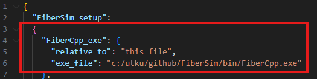
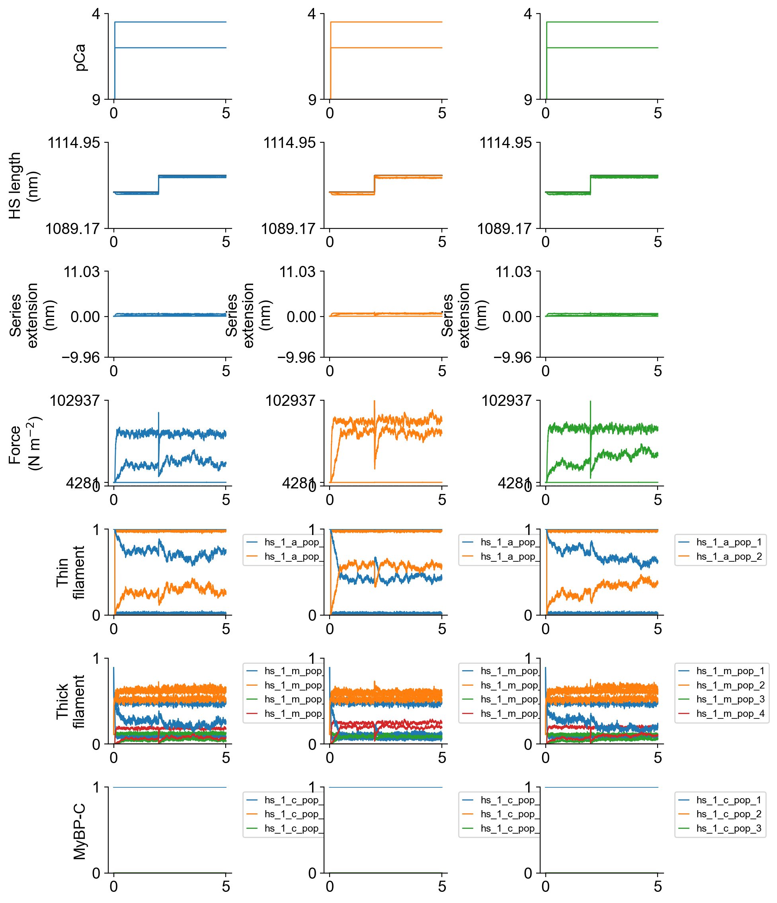
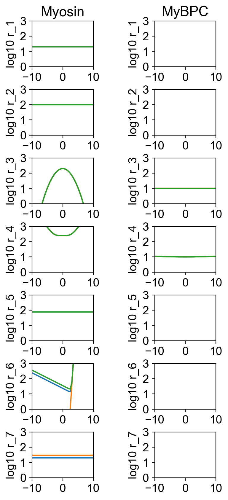

# Repository for stretch activation simulations

This repository contains framework that lets users to quickly test kinetic schemes for step length changes. The current kinetic scheme has 5 states with a transition between post- and pre-powerstroke.

The instructions to how to install FiberSim can be found [here](https://campbell-muscle-lab.github.io/FiberSim/pages/installation/installation.html). **FiberSim works exclusively on Windows machines.**

The pipeline in this repo uses the characterization module of FiberSim. Characterization module helps users to quickly scan range of parameter values to explore how the system responds.

[This demo](https://campbell-muscle-lab.github.io/FiberSim/pages/demos/model_comparison/parameter_adjustments/parameter_adjustments.html) provides a great example on how modulating the Ca sensitivity of the thin filament and / or the rate of a myosin power stroke changes the force-pCa relationship and ktr.

The [setup file](https://campbell-muscle-lab.github.io/FiberSim/pages/framework/framework.html) has a field, shown in red rectangle blow, for the FiberSim .exe file location. Please make sure to modify to reflect the location on your machine. [Visual Studio Code](https://code.visualstudio.com/) is a good tool for editing text based files in this repository.

Current simulations shows the force responses to step stretches by varying the transition rate between the post- and pre- powerstroke states. Each scenario (blue, orange, and green traces) was tested for pCa 4.5, 6.0, and 9.0. A demo on force responses to controlled length changes can be found [here](https://campbell-muscle-lab.github.io/FiberSim/pages/demos/length_changes/steps/steps.html).

Here is the summary of the kinetic scheme.

